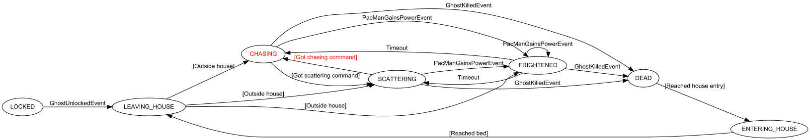

# Finite-State Machine

A finite-state machine implementation with the following features:
- Supports definition of state machines in declarative style using the builder pattern
- Supports *onEntry* and *onExit* actions for states
- Supports registration of state entry and state exit listeners
- Supports *onTick* actions for states which are triggered by a clock
- States can be implemented as subclasses of the generic *State* class
- States can have a timer and trigger a transition on timeout
- State transitions can be triggered by combinations of 
  - conditions (guards)
  - event conditions (match transitions by event value/equality or by event class)
  - state timeout
- Supports transition actions with information about the event that triggered the transition
- Actions can be implemented by lambda expression or function references
- Tracing of state machine processing to some logger
- Transitions can be annotated (used by export to Graphviz format)
- State graph can be exported into Graphviz ("dot") format
- Drawbacks: No hierarchical states supported

The states are identified by some arbitrary type, normally an enumeration type, string or integer.

## Example 1: Traffic light

A somewhat trivial example is a [traffic light](https://github.com/armin-reichert/statemachine-samples/blob/master/TrafficLight/src/main/java/de/amr/statemachine/samples/trafficlight/TrafficLight.java) controlled using timers.

```java
public class TrafficLight extends StateMachine<Light, Void> {

	public enum Light {
		OFF, RED, YELLOW, GREEN;
	}

	public TrafficLight() {
		//@formatter:off
		super(Light.class);
		beginStateMachine()
			.description("Traffic Light")
			.initialState(OFF)
			.states()
				.state(OFF)
				.state(RED).timeoutAfter(() -> app().clock().sec(3))
				.state(YELLOW).timeoutAfter(() -> app().clock().sec(2))
				.state(GREEN).timeoutAfter(() -> app().clock().sec(5))
			.transitions()
				.when(OFF).then(RED).condition(() -> Keyboard.keyPressedOnce(KeyEvent.VK_SPACE))
				.when(RED).then(GREEN).onTimeout()
				.when(GREEN).then(YELLOW).onTimeout()
				.when(YELLOW).then(RED).onTimeout()
		.endStateMachine();
		//@formatter:off
	}
}
```

## Example 2: Application lifecycle

In my [game library](https://github.com/armin-reichert/easy-game), each application has a lifecycle implemented as a finite-state machine.

```java
class ApplicationLifecycle extends StateMachine<ApplicationState, ApplicationEvent> {

	enum ApplicationState {
		INITIALIZING, CREATING_UI, RUNNING, PAUSED, CLOSING;
	}

	enum ApplicationEvent {
		PAUSE, RESUME, ENTER_FULLSCREEN_MODE, ENTER_WINDOW_MODE, SHOW_SETTINGS_DIALOG, CLOSE
	}

	ApplicationLifecycle(Application app, String[] cmdLine) {
		super(ApplicationState.class, TransitionMatchStrategy.BY_VALUE);
		/*@formatter:off*/		
		beginStateMachine()
			.description(String.format("[%s]", app.getName()))
			.initialState(INITIALIZING)
			.states()
				
				.state(INITIALIZING)
					.onEntry(() -> {
						loginfo("Configuring application '%s'", app.getName());
						app.configure(app.settings);
						app.processCommandLine(cmdLine);
						app.printSettings();
						app.init();
						if (app.settings.muted) {
							app.soundManager.muteAll();
						}
						setState(CREATING_UI);
					})
					
				.state(CREATING_UI)	
					.onEntry(() -> {
						SwingUtilities.invokeLater(() -> {
							app.createUserInterface();
							app.clock.start();
							loginfo("Application is running, %d frames/second", app.clock.getTargetFramerate());
						});
					})
				
				.state(RUNNING)
					.onTick(() -> {
						app.readInput();
						app.controller.update();
						app.renderCurrentView();
					})
				
				.state(PAUSED)
					.onTick(app::renderCurrentView)
				
				.state(CLOSING)
					.onEntry(() -> {
						loginfo("Closing application '%s'", app.getName());
					})
					.onTick(() -> {
						app.shell.dispose();
						// cannot exit in onEntry because CLOSING listeners would not get executed!
						System.exit(0);
					})
					
			.transitions()

				.when(CREATING_UI).then(RUNNING).condition(() -> app.clock.isTicking())
				
				.when(RUNNING).then(PAUSED).on(PAUSE).act(() -> app.soundManager.muteAll())
				
				.when(RUNNING).then(CLOSING).on(CLOSE)
	
				.stay(RUNNING).on(ENTER_FULLSCREEN_MODE).act(() -> app.shell.showFullScreenWindow())

				.stay(RUNNING).on(ENTER_WINDOW_MODE).act(() -> app.shell.showWindow())
					
				.stay(RUNNING).on(SHOW_SETTINGS_DIALOG).act(() -> app.shell.showF2Dialog())
				
				.when(PAUSED).then(RUNNING).on(RESUME).act(() -> app.soundManager.unmuteAll())
			
				.when(PAUSED).then(CLOSING).on(CLOSE)
				
				.stay(PAUSED).on(ENTER_FULLSCREEN_MODE).act(() -> app.shell.showFullScreenWindow())

				.stay(PAUSED).on(ENTER_WINDOW_MODE).act(() -> app.shell.showWindow())
	
				.stay(PAUSED).on(SHOW_SETTINGS_DIALOG).act(() -> app.shell.showF2Dialog())

		.endStateMachine();
		/*@formatter:on*/
	}
}
```

## Example 3: Menu and controller for [Pong game](https://github.com/armin-reichert/pong)

### Menu controller

```java
beginStateMachine()
	.description("Pong Menu")
	.initialState(Player1_Player2)

	.states()

		// for clarity, all states are listed, would also work without!
		.state(Player1_Player2)
		.state(Player1_Computer)
		.state(Computer_Player2)
		.state(Computer_Computer)

	.transitions()

		.when(Player1_Player2)	.then(Player1_Computer)	.condition(this::nextEntrySelected)
		.when(Player1_Computer)	.then(Computer_Player2)	.condition(this::nextEntrySelected)
		.when(Computer_Player2)	.then(Computer_Computer).condition(this::nextEntrySelected)
		.when(Computer_Computer).then(Player1_Player2)	.condition(this::nextEntrySelected)

		.when(Player1_Player2)	.then(Computer_Computer).condition(this::prevEntrySelected)
		.when(Computer_Computer).then(Computer_Player2)	.condition(this::prevEntrySelected)
		.when(Computer_Player2)	.then(Player1_Computer)	.condition(this::prevEntrySelected)
		.when(Player1_Computer)	.then(Player1_Player2)	.condition(this::prevEntrySelected)

.endStateMachine();
```

### Game Controller:

```java
public enum PlayState {
	INIT, PLAYING, SERVING, GAME_OVER;
}

beginStateMachine()
	.description("Pong")	
	.initialState(INIT)

.states()
	.state(INIT).onEntry(this::initEntities)
	.state(SERVING).timeoutAfter(app().clock.sec(2)).onEntry(this::prepareService)
	.state(PLAYING).onTick(this::updateEntities)
	.state(GAME_OVER)

.transitions()
	.when(INIT).then(SERVING).act(this::resetScores)
	.when(SERVING).then(PLAYING).onTimeout().act(this::serveBall)
	.stay(PLAYING).condition(this::leftPaddleHitsBall).act(this::returnBallWithLeftPaddle)
	.stay(PLAYING).condition(this::rightPaddleHitsBall).act(this::returnBallWithRightPaddle)
	.when(PLAYING).then(SERVING).condition(this::isBallOutLeft).act(this::assignPointToRightPlayer)
	.when(PLAYING).then(SERVING).condition(this::isBallOutRight).act(this::assignPointToLeftPlayer)
	.when(PLAYING).then(GAME_OVER).condition(() -> leftPlayerWins() || rightPlayerWins())
	.when(GAME_OVER).then(INIT).condition(() -> Keyboard.keyPressedOnce(KeyEvent.VK_SPACE))

.endStateMachine();
```

## Example 4: Flappy-Bird game controller 

A slightly more complex example is the game controller of my [Flappy Bird](https://github.com/armin-reichert/birdy) game implementation.

```java
beginStateMachine()
	.description("[Play Scene]")
	.initialState(PLAYING)

.states()

	.state(PLAYING)
		.onEntry(() -> {
			points = 0;
			start();
		})

	.state(GAME_OVER)
		.onEntry(() -> stop())

.transitions()

	.stay(PLAYING)
		.on(TOUCHED_PIPE)
		.condition(() -> points > 3)
		.act(e -> {
			points -= 3;
			sound("sfx/hit.mp3").play();
			Bird bird = ent.named("bird");
			bird.tf.x += app().settings().getAsInt("obstacle-width") + bird.tf.width;
			bird.dispatch(TOUCHED_PIPE);
		})

	.stay(PLAYING)
		.on(PASSED_OBSTACLE)
		.act(e -> {
			points++;
			sound("sfx/point.mp3").play();
		})

	.when(PLAYING).then(GAME_OVER)
		.on(TOUCHED_PIPE)
		.condition(() -> points <= 3)
		.act(t -> {
			sound("sfx/hit.mp3").play();
			Bird bird = ent.named("bird");
			bird.dispatch(CRASHED);
		})

	.when(PLAYING).then(GAME_OVER)
		.on(TOUCHED_GROUND)
		.act(e -> {
			sound("music/bgmusic.mp3").stop();
			Bird bird = ent.named("bird");
			bird.dispatch(TOUCHED_GROUND);
		})

	.when(PLAYING).then(GAME_OVER)
		.on(LEFT_WORLD)
		.act(e -> {
			sound("music/bgmusic.mp3").stop();
			Bird bird = ent.named("bird");
			bird.dispatch(LEFT_WORLD);
		})

	.stay(GAME_OVER)
		.condition(() -> Keyboard.keyPressedOnce(KeyEvent.VK_SPACE))
		.act(() -> BirdyGameApp.setScene(START_SCENE))

	.stay(GAME_OVER)
		.on(TOUCHED_GROUND)
		.act(() -> sound("music/bgmusic.mp3").stop())

.endStateMachine();
```

## Example 5: Pac-Man ghost "AI"

I used this state machine library extensively in my [Pac-Man game implementation](https://github.com/armin-reichert/pacman), which in fact was the main motivation for creating this library at all. In that implementation, state machines are used all over the place: for the central game control, for Pac-Man and the ghosts, for their movement, for controlling the animations in the intro view and more.



This is the state machine controlling the behavior of the ghosts:

```java
ai.beginStateMachine()
	.description(name + " AI")
	.initialState(LOCKED)

	.states()

		.state(LOCKED)
			.onEntry(() -> {
				visible = true;
				recovering = false;
				bounty = 0;
				nextState = LOCKED;
				placeIntoBed();
			})
			.onTick(this::move)

		.state(LEAVING_HOUSE)
			.onTick(this::move)
			.onExit(() -> forceMoving(Direction.LEFT))

		.state(ENTERING_HOUSE)
			.onTick(this::move)

		.state(SCATTERING)
			.onTick(() -> {
				updateMentalHealth();
				checkPacManCollision(pacMan);
				move();
			})

		.state(CHASING)
			.onTick(() -> {
				updateMentalHealth();
				checkPacManCollision(pacMan);
				move();
			})

		.state(FRIGHTENED)
			.timeoutAfter(this::getFrightenedTicks)
			.onTick((state, consumed, remaining) -> {
				updateMentalHealth();
				checkPacManCollision(pacMan);
				move();
				recovering = remaining < getFlashTimeTicks();
			})

		.state(DEAD)
			.timeoutAfter(sec(1))
			.onEntry(this::computeBounty)
			.onTick((s, consumed, remaining) -> {
				if (remaining == 0) {
					bounty = 0;
					move();
				}
			})

	.transitions()

		.when(LOCKED).then(LEAVING_HOUSE).on(GhostUnlockedEvent.class)

		.when(LEAVING_HOUSE).then(SCATTERING)
			.condition(() -> justLeftHouse() && nextState == SCATTERING)
			.annotation("Outside house")

		.when(LEAVING_HOUSE).then(CHASING)
			.condition(() -> justLeftHouse() && nextState == CHASING)
			.annotation("Outside house")

		.when(LEAVING_HOUSE).then(FRIGHTENED)
			.condition(() -> justLeftHouse() && nextState == FRIGHTENED)
			.annotation("Outside house")

		.when(ENTERING_HOUSE).then(LEAVING_HOUSE)
			.condition(() -> getSteering().isComplete())
			.annotation("Reached bed")

		.when(CHASING).then(FRIGHTENED)
			.on(PacManGainsPowerEvent.class)
			.act(this::reverseDirection)

		.when(CHASING).then(DEAD)
			.on(GhostKilledEvent.class)

		.when(CHASING).then(SCATTERING)
			.condition(() -> nextState == SCATTERING)
			.act(this::reverseDirection)
			.annotation("Got scattering command")

		.when(SCATTERING).then(FRIGHTENED)
			.on(PacManGainsPowerEvent.class)
			.act(this::reverseDirection)

		.when(SCATTERING).then(DEAD)
			.on(GhostKilledEvent.class)

		.when(SCATTERING).then(CHASING)
			.condition(() -> nextState == CHASING)
			.act(this::reverseDirection)
			.annotation("Got chasing command")

		.stay(FRIGHTENED).on(PacManGainsPowerEvent.class)
			.act(() -> ai.resetTimer(FRIGHTENED))

		.when(FRIGHTENED).then(DEAD)
			.on(GhostKilledEvent.class)

		.when(FRIGHTENED).then(SCATTERING)
			.onTimeout()
			.condition(() -> nextState == SCATTERING)

		.when(FRIGHTENED).then(CHASING)
			.onTimeout()
			.condition(() -> nextState == CHASING)

		.when(DEAD).then(ENTERING_HOUSE)
			.condition(this::isAtHouseEntry)
			.annotation("Reached house entry")

	.endStateMachine();
/*@formatter:on*/
ai.setMissingTransitionBehavior(MissingTransitionBehavior.LOG);
```
